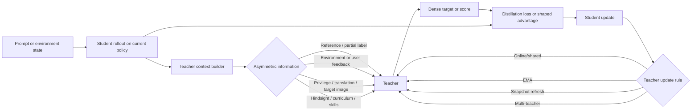
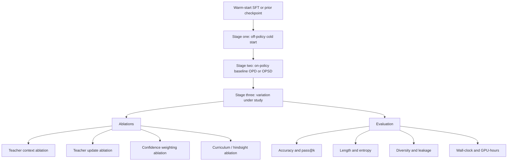

# On-Policy Self-Distillation with Asymmetric Teacher Feedback

> Research note. This file was moved from the repository root during the
> 2026-07-04 docs cleanup. It is not an operational runbook, and some citation
> markers are raw research-session placeholders rather than durable links.

## Executive summary

On-policy self-distillation sits at the intersection of knowledge distillation, interactive imitation learning, and reinforcement learning. Its defining move is to train on trajectories sampled from the *current student policy* rather than on a fixed teacher-generated corpus, then provide *teacher-side supervision on those same student-visited states*. In the self-distillation case, the teacher is usually the same base model under richer conditioning—such as a reference solution, environment feedback, a user follow-up, a translation, a target image, or a hindsight summary—while the student acts under the deployment-time input alone. This design directly targets train–test mismatch and sparse credit assignment, which is why recent work has expanded rapidly from language-model compression to reasoning RL, multi-turn agents, multilingual reasoning, theorem proving, multimodal generation, and diffusion-style models. citeturn34search12turn19search3turn16search1turn37search12turn6search0

The literature now supports a useful practical taxonomy. The most important axis is not “self-distillation or not,” but *what asymmetry the teacher gets*: full or partial labels, noisy or weak user corrections, confidence gating, delayed or hindsight feedback, curricula over trajectory depth, privileged information, modality asymmetry, reward-shaping or critique signals, human-in-the-loop corrections, and counterfactual or contrastive feedback. A second axis is *how the teacher itself is updated*: online/shared-parameter teacher, EMA teacher, frozen episodic snapshot, or multi-teacher ensemble. A third axis is the output form: token logits, rubric/verbal scores, per-step advantages, or sequence rewards. Recent surveys and overviews on OPD/OPSD converge on this multi-axis view, even though terminology is still not fully standardized. citeturn9search7turn7search13turn11search18turn12search11

The strongest empirical pattern across recent papers is that richer feedback helps only when it is *aligned with the student’s causal errors* and not too far from the student’s reachable distribution. Step-aligned critiques outperform binary rewards and full-reference conditioning in recent reasoning studies; adaptive teacher exposure improves over always showing the teacher the full rationale; confidence-aware weighting stabilizes training; temporal curricula help in long-horizon agents; and multi-teacher systems help when one teacher would otherwise cap performance or erase domain specialization. At the same time, several papers now document failure modes: self-distillation can suppress uncertainty, reduce diversity, leak privileged information, or collapse when the teacher’s reasoning style is incompatible with the student’s. citeturn20search0turn31search0turn30search0turn29search0turn15search1turn20search2turn31search5turn38academia15turn37search13

For implementation, the current highest-leverage open stack is **verl + vLLM + FSDP/ZeRO + Ray + W&B/MLflow/TensorBoard**, with TRL and OpenRLHF as strong alternatives when the experiment is primarily RLHF- or GRPO-centric. The most reproducible starting recipe in public code today is a frozen teacher per update window, vLLM-based teacher inference, FSDP student training, low actor learning rate around `1e-6`, modest on-policy group size, dynamic batch sizing, and explicit monitoring of KL overlap, entropy, response length, and pass@k—not just accuracy. citeturn16search1turn16search3turn18search0turn18search1turn18search2turn17search0turn17search1turn17search2turn24view0

## Definitions and taxonomy

The classic distillation lineage begins with Hinton, Vinyals, and Dean’s teacher–student compression framework, then branches into sequence-level distillation for generation, born-again/self-distillation with same-capacity models, and generalized distillation for privileged information. These older ideas matter because modern on-policy self-distillation is best understood as combining three older intuitions: soft-target transfer, sequence-level supervision, and learning with training-time-only privileged context. citeturn21search0turn21search2turn21search4turn11search9turn11search6

The move from *off-policy* to *on-policy* distillation was made explicit for language models by Generalized Knowledge Distillation, which trains the student on its own sampled outputs and asks the teacher to score those student trajectories. The same motivation appears in RL: DAgger-style learning reduces compounding error by querying supervision on states induced by the current learner, not just expert trajectories. This is the central reason OPD/OPSD is repeatedly framed as an antidote to “exposure bias” or “distribution mismatch.” citeturn34search12turn10search3turn16search1turn34search7

A concise working definition is therefore: **on-policy self-distillation** trains a model on trajectories sampled from its own current policy while a self-teacher—usually the same model under richer conditioning—provides denser supervision on those trajectories. The richer conditioning can be ground-truth solutions, verified answers, environment feedback, cross-lingual translations, multimodal targets, user follow-ups, hindsight summaries, or latent skills extracted from past trajectories. OPSD for reasoning and SDPO for RL with rich feedback are the canonical recent instances. citeturn14search1turn6search0turn19search6turn19search10

That taxonomy can be organized along four axes. First is **trajectory source**: pure student rollouts, trust-region-blended rollouts, or curriculum-restricted partial trajectories. Second is **teacher-side asymmetry**: privileged solution context, feedback text, user edits, translations, images, rubrics, or hindsight summaries. Third is **target form**: full token distribution, top-k distribution, verbal/rubric score, or shaped advantage. Fourth is **teacher update rule**: shared online teacher, EMA teacher, periodically refreshed teacher, or multi-teacher ensemble. This four-axis decomposition is more analytically useful than a simple list of algorithms because many recent papers differ by only one axis while sharing the others. citeturn12search11turn20search2turn9search7turn15search0turn15search1

This workflow is directly reflected in recent OPSD, SDPO, OPCD, COPSD, Skill-SD, and multimodal/self-feedback extensions, even when the loss function and feedback channel differ. citeturn14search1turn6search0turn9search1turn32search6turn28search0turn22search1

## Variations in asymmetric feedback and teacher-side data

The table below compares the main asymmetry patterns that now recur in the literature.

| Variation | Typical teacher asymmetry | Common teacher update | Expected benefit | Main risk | Recommended tasks | Key references |
|---|---|---|---|---|---|---|
| Full reference-solution conditioning | Teacher sees full verified trace/solution; student sees task only | Frozen or shared online | Strong dense targets; easy to implement | Style mismatch; privileged leakage; overwriting already-correct reasoning | Math reasoning, theorem proving | OPSD citeturn14search1turn22search13 |
| Partial labels or adaptive exposure | Teacher sees only part of the reference or a controlled reveal ratio | Online controller + delayed updates | Better match to student competence; less over-strong supervision | Extra controller complexity; delayed-credit tuning | Reasoning with long CoT | ATESD citeturn31search0turn30search10 |
| Environment-text feedback | Teacher sees compiler errors, judge comments, test outputs, verifier text | Shared online teacher | Converts sparse reward into token-level correction | Feedback quality varies; may overfit feedback style | Code, science reasoning, tool use | SDPO citeturn6search0turn25view0 |
| Weak, noisy, or implicit user feedback | Teacher sees follow-up user message, edits, preferences, or weak coactive improvement | Online / continual | Learns from deployment data without explicit labels | Feedback is noisy, delayed, and user-specific | Alignment, personalization, dialogue | Aligning from User Interactions; CoRLL citeturn19search4turn10search7 |
| Confidence-weighted targets | Teacher entropy, perplexity, or KL gap reweights tokens/samples | Usually frozen per batch | Down-weights unreliable teacher regions; stabilizes training | Can suppress useful exploration if too aggressive | Reasoning, long CoT | EGRSD; SCOPE; SRPO citeturn30search0turn8search0turn6search2 |
| Delayed, hindsight, or counterfactual feedback | Teacher conditions on full-trajectory outcomes, hindsight blocks, or contrastive alternatives | Episodic / hindsight teacher | Better credit assignment in sparse or long-horizon settings | More expensive context building; can amplify hindsight bias | Search, agents, theorem proving | SD-Search; HinT-SD; CREDIT citeturn12search0turn12search12turn7search2 |
| Curriculum-based sampling | Teacher supervises only shallow prefixes or short trajectories early, then longer ones later | Frozen teacher + curriculum schedule | Prevents KL blow-up under long-horizon error compounding | Curriculum schedule may be task-specific | Agents, WebShop, ALFWorld, ScienceWorld | TCOD citeturn29search0 |
| Privileged information | Teacher sees hidden state, action-only PI, hints, or task explanations unavailable at test time | Joint/shared or frozen | Makes hard tasks learnable without test-time PI | Leakage and dependence on PI quality | Multi-turn agents, long-horizon tasks | π-Distill / PID for LMs; Generalized distillation | citeturn37search0turn11search9 |
| Modality asymmetry | Teacher sees image/video/target artifact; student sees text or reduced modality | Shared self-teacher or multimodal teacher | Distills multimodal competence into cheaper inference pipeline | Cross-modal mismatch; target extraction cost | Diffusion tuning, chart/UI/slide generation | D-OPSD; Visual-SDPO citeturn22search1turn6search4 |
| Rubric or verbal feedback | Teacher provides rubrics or discrete scores rather than logits | External or black-box teacher | Works with API-only teachers; lower memory | Loses fine token-level detail; judge calibration matters | Proprietary-teacher distillation, alignment | ROPD; OVD citeturn9search0turn33academia17 |
| Human-in-the-loop corrections | Expert/human revises, ranks, or safely intervenes on student states | Episodic or continual | High-value corrections exactly on learner errors | Expensive and safety-sensitive | Robotics, driving, personalization | DAgger; HG-DAgger; RLHF | citeturn10search3turn10search0turn10search2turn35search0 |
| Crosslingual privileged context | Teacher sees translation plus high-resource solution; student sees low-resource prompt | Shared/frozen same model | Transfers reasoning to low-resource languages | Translation errors; English-centric bias | Multilingual math reasoning | COPSD citeturn32search6 |

Several concrete variation families now look especially mature. **Reference-conditioned OPSD** is the cleanest baseline: the teacher receives verified reasoning traces or answers, while the student sees only the problem, and training minimizes token-level divergence on student-generated rollouts. This is the setup introduced by Self-Distilled Reasoner, which reports 4–8× token-efficiency gains over GRPO-style RL baselines on math reasoning. Its advantages are simplicity and strong dense supervision; its weaknesses are privileged-information leakage and the tendency to overwrite correct-but-different reasoning paths. citeturn14search1turn22search13turn37search13turn20search0

**Partial-label and adaptive-exposure methods** modify that baseline by asking whether “more teacher context” is always better. ATESD argues it is not: teacher–student mismatch grows monotonically as the teacher sees more privileged reasoning, and a learned reveal ratio can outperform both fixed full and fixed partial exposure on AIME and HMMT across Qwen3 model sizes. The upside is better capability matching between teacher and student; the downside is an additional controller with delayed policy-gradient credit assignment. citeturn31search0turn31search1

**Environment-feedback self-distillation** is represented most clearly by SDPO. Here the teacher is the same model conditioned on textual feedback from the world—compiler errors, unit-test failures, judge comments, or successful peer rollouts—and that conditioned distribution is distilled back into the student. The official repo and paper emphasize faster convergence than GRPO, improved sample efficiency on scientific reasoning, tool use, and LiveCodeBench v6, and even effective test-time self-distillation on hard tasks. The chief open question is how far this extends when the feedback channel is noisy, underspecified, or strategically gamed. citeturn6search0turn25view0turn6search3

**Weak, noisy, and user-derived feedback** currently appears in two adjacent strands. Aligning Language Models from User Interactions shows that raw follow-up turns in real conversations can be used as hindsight feedback for self-distillation, improving standard alignment and instruction-following benchmarks from WildChat without explicit labels or reward models. Coactive learning for LLMs shows that edited outputs can serve as weak and noisy improvement signals with theoretical grounding. The pro is obvious deployment realism; the con is that weak user signals are heterogeneous, delayed, and confounded by preference drift. citeturn19search4turn19search7turn10search7turn10search13

**Confidence-weighted and uncertainty-aware targets** are now one of the most active stabilization directions. SCOPE uses teacher-perplexity weighting on incorrect trajectories and student-perplexity weighting on correct ones; EGRSD/CL-EGRSD gate token updates by teacher entropy; SRPO routes failed samples to self-distillation but correct samples to GRPO-like reward optimization, with entropy-aware weighting to avoid unreliable distillation. These methods consistently report better stability or better accuracy–length tradeoffs than uniform token weighting. The unresolved issue is whether confidence gates merely stabilize training or also entrench teacher overconfidence and reduce search diversity. citeturn8search0turn30search0turn6search2turn31search5turn38academia15

**Delayed, hindsight, and counterfactual feedback** dominate the long-horizon-agent literature. SD-Search conditions the teacher on a hindsight block built from the rollout group and outcomes, giving step-level supervision without an external teacher. HinT-SD applies targeted self-distillation only to failure-relevant action spans. CREDIT interprets ordinary self-distillation reward as pointwise mutual information and adds a contrastive baseline to isolate input-specific credit. The common empirical lesson is that full-trajectory hindsight is most useful when sequence-level rewards are too sparse to identify *which* turn caused failure. citeturn12search0turn12search6turn12search12turn7search2

**Curriculum-based sampling** is best exemplified by TCOD, which progressively exposes longer trajectory depths during training and reports up to 18-point gains over vanilla OPD on ALFWorld, WebShop, and ScienceWorld. This is arguably the cleanest response to trajectory-level KL instability in multi-turn agents. Its main limitation is schedule sensitivity: the correct curriculum is likely environment-specific. citeturn29search0turn29search2

**Privileged-information asymmetry** has both classical and modern forms. Generalized distillation and LUPI supply the theoretical template, while Privileged Information Distillation for Language Models introduces π-Distill and an OPSD variant for multi-turn agents where frontier teachers expose only action trajectories, not reasoning, and yet training-time PI still helps distill behaviors that are hard without PI. This family is attractive for long-horizon settings where hidden state, hints, or explanations are available during training but impossible at inference. The central risk is leakage: several recent analyses show that OPSD can teach the student to implicitly depend on clues it will not have at test time. citeturn11search9turn11search6turn37search0turn37search13

**Modality asymmetry** is now visible beyond text. D-OPSD fine-tunes step-distilled diffusion models by using the same model as teacher and student with different contexts: the student is conditioned on text only, while the teacher sees both text and target image. Visual-SDPO extends the same idea to visually grounded code generation, where rendered artifacts and defect localization are privileged context for the teacher. These papers are important because they demonstrate that OPSD is not inherently autoregressive-text-only; the core requirement is asymmetric information on student-visited trajectories. citeturn22search1turn6search4turn22search10

**Rubric- and verbal-feedback variants** address the black-box teacher problem. Rubric-based OPD induces prompt-specific rubrics from teacher–student contrasts and then scores student rollouts without teacher logits, while OVD replaces token-level logit matching with verbal 0–9 trajectory scores and reports substantial gains with lower memory use. The practical attraction is obvious for proprietary APIs. The tradeoff is that coarse verbal/rubric signals can be easier to collect but harder to calibrate than logits. citeturn9search0turn19search17turn33academia17

**Human-in-the-loop correction** remains a seminal inspiration rather than the dominant 2026 OPSD form. DAgger’s no-regret framing and HG-DAgger’s real-world human-supervision modifications are still the most relevant theoretical ancestors when asymmetric teacher data comes from interventions on learner states rather than from model-generated feedback. RLHF and human-preference learning sit slightly further away architecturally, but they remain the clearest evidence that sparse human correction can be practical if focused on the learner’s actual trajectories. citeturn10search3turn10search0turn10search2turn35search0

## Teacher update mechanisms, theory, and known limitations

The **online/shared-parameter teacher** is the signature mechanism of modern OPSD. OPSD, SDPO, OPCD, COPSD, and several recent variants all use one base model to play two roles simultaneously, differentiated by context rather than by architecture. This yields minimal parameter overhead and makes it easy to change the information asymmetry. Theoretical motivation comes from the idea that the same model already has latent competence that can be “elicited” by added context and then distilled back into deployment-time behavior. The limitation is coupling: when teacher and student are too tightly linked, teacher quality may degrade or simply mirror student blind spots. citeturn14search1turn6search0turn9search1turn32search6turn20search1

The **EMA teacher** is less common in current LLM OPSD papers but is a major precedent in semi-supervised and self-supervised learning. Mean Teacher updates the teacher as an exponential moving average of the student, explicitly reporting this as the core improvement over temporal ensembling, with 0.999 as a recommended starting EMA decay. BYOL likewise uses an EMA target network and argues that the target update helps prevent collapse. For OPSD researchers, the lesson is that EMA teachers are most attractive when the target distribution should be smoother and less noisy than a fully shared teacher. The downside is slower adaptation when feedback distributions change quickly. citeturn26view0turn27view0

The **episodic or snapshot teacher** is the default in many practical OPD implementations even when papers do not foreground it as a contribution: teacher logits are frozen during rollout generation or over a short update window, then refreshed later. Skill-SD makes this design axis explicit by showing that dynamic teacher synchronization outperforms a fully frozen teacher in AppWorld and Sokoban, while still using trajectory-derived skills as privileged context. This snapshot pattern is often the safest starting choice when full online coupling is unstable. citeturn28search0turn14search0

The **multi-teacher ensemble** is rapidly becoming important in production-oriented OPD. MiMo-V2-Flash describes multi-teacher OPD with domain-specialized teachers. MAD-OPD uses multi-agent debate to create a collective teacher whose confidence-weighted post-debate outputs supervise the student. CaMOPD alternates recovery and preservation teachers to recover general ability without destroying vertical-domain specialization. The empirical benefit is clear when one teacher would otherwise impose a capability ceiling or conflicting gradients; the main risk is teacher counteraction and much higher inference cost during training. citeturn15search2turn15search1turn15search0

The main theoretical motivations come from three older lines of work. First, DAgger formalizes why supervision on learner-induced states reduces compounding error and provides no-regret guarantees. Second, generalized distillation and LUPI formalize why training-time-only information can still improve a student that must infer without it later. Third, distillation theory in RL shows that not every apparently reasonable on-policy update is actually optimizing a well-defined objective; Czarnecki et al. prove that common student-sampled distillation updates need not form a gradient vector field, though they also identify convergent variants such as expected entropy-regularized distillation. citeturn10search3turn11search9turn11search6turn36view0turn39view0

Recent theory for LLM OPD/OPSD is becoming sharper but remains young. Rethinking OPD identifies two empirical preconditions for success: teacher and student should share compatible thinking patterns, and the teacher must provide genuinely new capabilities, not just higher scores on indistinguishable distributions. CREDIT shows that the token reward in OPSD can be interpreted as a Bayesian-filtering increment whose trajectory sum equals pointwise mutual information between response and feedback, motivating contrastive baselines to isolate input-specific credit. DistIL, a 2026 distributional DAgger formulation for rich feedback, argues that forward cross-entropy admits monotonic policy improvement and regret guarantees, while reverse-KL or Jensen–Shannon self-distillation may increase probability on worse actions even when the expert is stronger. citeturn20search2turn7search2turn5search13

Limitations are now well documented. Self-distillation can suppress epistemic verbalization and shorten responses while degrading reasoning quality; it can concentrate mass on dominant modes and flatten pass@k even when pass@1 improves; it can leak privileged information into the student’s overt reasoning; and it can become unstable when correct samples are also self-distilled, creating what SRPO calls “optimization ambiguity.” These concerns suggest that future OPD work should report *diversity, uncertainty, and leakage diagnostics* alongside raw accuracy. citeturn31search5turn38academia15turn37search13turn6search2

## Frameworks, libraries, and implementation recipes

For public experimentation, **verl** is currently the most directly relevant framework because it has explicit OPD support and documents single-teacher, multi-teacher, text, and multimodal on-policy distillation. Its docs position OPD as training a student on self-sampled states with dense teacher supervision, and recent changelogs note support for reverse KL, forward top-k KL, fused top-k kernels, and sync or async trainers. **TRL** is the easiest entry point when the experiment is mostly GRPO/RLHF and one wants to add distillation logic. **OpenRLHF** is attractive for scalable RLHF and multi-agent settings. **vLLM** is the current default rollout and teacher-inference engine for high-throughput distributed generation. citeturn16search1turn16search5turn16search21turn16search0turn16search2turn16search3

For systems support, the current standard stack is **PyTorch FSDP** or **DeepSpeed ZeRO** for memory-efficient distributed training, plus **Ray Train** when cluster orchestration is needed. Official docs emphasize that FSDP shards parameters, gradients, and optimizer state to reduce memory footprint, while ZeRO partitions optimizer states, gradients, and parameters across workers. vLLM’s docs additionally support tensor/pipeline/context parallel inference, and Ray Train scales from one machine to many while abstracting distributed execution. citeturn18search0turn18search3turn18search1turn18search2turn16search7

For observability, **W&B**, **MLflow**, and **TensorBoard** are all sufficient, but they serve slightly different purposes. W&B is strongest for rapid experiment tracking and comparisons across many runs; MLflow is strongest if artifact lineage and model registry matter; TensorBoard remains the easiest lightweight option for learning curves, histograms, and profiling. In OPD work, these tools are most valuable when they log *teacher–student KL, token entropy, response length, rollout diversity, success rate, and wall-clock time to target accuracy* in addition to model metrics. citeturn17search0turn17search1turn17search10turn17search2turn17search5

A strong **baseline LLM-reasoning recipe** is now visible in public code. The official THU OPD `verl_example/opd.sh` uses `train_batch_size=64`, `ppo_mini_batch_size=16`, `ppo_micro_batch_size_per_gpu=1`, `actor_lr=1e-6`, `distillation_topk=16`, `max_prompt_length=1024`, `max_response_length=7168`, `ppo_max_token_len_per_gpu=8192`, rollout GPU memory utilization `0.7`, teacher GPU memory utilization `0.5`, FSDP parameter and optimizer offload, `n=4` rollouts per prompt, and explicit log-prob/loss clamping. Those are not universal optima, but they are a credible public starting point for a 1–8B reasoning student with one stronger teacher. citeturn24view0

A strong **SDPO-style recipe** is also public. The official repo recommends Linux + NVIDIA GPUs, uses a verl-based stack, and exposes knobs such as `actor.policy_loss.loss_mode="sdpo"`, maximum reprompted length `10240`, `include_environment_feedback=True`, `environment_feedback_only_without_solution=True`, `dont_reprompt_on_self_success=True`, and `remove_thinking_from_demonstration=True`. The code and README also emphasize that rich feedback can be textual, that the student can improve even when the environment itself only returns sparse success by reusing high-reward rollouts as implicit feedback, and that the method was run on 4× GH200 nodes in the public results. citeturn25view0

For **EMA-teacher experiments**, the best-documented public recipe still comes from Mean Teacher and BYOL rather than LLM OPSD. Mean Teacher recommends starting with EMA decay `0.999`, putting roughly one-quarter to one-half labeled samples in each minibatch when labels are scarce, using augmentation/noise on both student and teacher inputs, and ramping up consistency cost over early epochs. BYOL examples show momentum schedules from about `0.996` toward `1.0`. For OPD researchers, these values are useful when prototyping stabilized teachers for noisy or semi-supervised feedback channels. citeturn26view0turn27view0

For **long-horizon agentic OPSD**, recent papers suggest three concrete heuristics. First, dynamically synchronize or refresh the teacher rather than freezing it forever, as in Skill-SD. Second, expose shallow trajectories early and increase horizon with a temporal curriculum, as in TCOD. Third, use smaller local clipping or trust-region-style stabilizers and tune global mixing strength separately, as StepOPSD highlights. These are exactly the knobs I would tune first in ALFWorld, WebShop, AppWorld, or Search-QA. citeturn28search0turn29search0turn8search7

## Experimental designs, recommended comparisons, and open questions

A rigorous comparison study should be *cross-regime*, not limited to one benchmark family. At minimum, I would use: math reasoning with verifiable answers such as AIME-style tasks and MATH-family benchmarks; code or science reasoning with rich environment feedback such as LiveCodeBench v6; theorem proving with Lean4 or LeanWorkbook; multi-turn agents such as ALFWorld, AppWorld, WebShop, ScienceWorld, Sokoban, and Search-QA; multilingual reasoning for cross-lingual asymmetry; one multimodal generation benchmark such as ChartMimic, Design2Code, or AeSlides; and one non-NLP control problem such as nuScenes motion planning if the goal is generality. This broad suite mirrors the benchmark families already used across recent OPSD/OPD papers. citeturn6search0turn38search0turn29search0turn28search0turn32search6turn6search4turn22search0

The most informative baselines are not just RL baselines. I recommend comparing each variation against: plain SFT or off-policy KD; external-teacher OPD/GKD; reference-conditioned OPSD; SDPO if feedback text exists; GRPO or PPO-style RLVR; a hybrid router such as SRPO when both reward and distillation are meaningful; and, for black-box teachers, OVD or rubric-based OPD. Without this ladder, it is hard to tell whether a new feedback asymmetry helps because of the asymmetry itself or because it simply introduces denser supervision than the baseline. citeturn34search12turn14search1turn6search0turn6search2turn33academia17turn9search0

The metric set should be broader than “final accuracy.” For single-turn reasoning, the default bundle should include pass@1, pass@k or avg@N, exact match when appropriate, response length, teacher–student KL, token entropy, and wall-clock time or tokens-to-target-performance. For agentic tasks, add episode success, step-level intervention rate, number of tool calls, and horizon-to-failure statistics. For self-distillation specifically, also report output diversity and test-time scaling curves because several current critiques show that gains at pass@1 can coexist with worse pass@k and flatter diversity curves. citeturn25view0turn20search0turn38academia15

The highest-value ablations are the ones that isolate *where the asymmetry matters*. I would always ablate: feedback content type; feedback granularity; whether distillation is applied on all trajectories or only failed ones; whether correct trajectories are routed to RL instead of distillation; teacher reveal ratio; teacher refresh schedule; confidence/entropy gating; rollout policy warmup or trust-region blending; curriculum horizon; and whether the teacher sees raw feedback, summarized feedback, or a contrastive/counterfactual variant. Those are the variables most often implicated by recent papers when they explain success or instability. citeturn20search0turn31search0turn6search2turn29search0turn8search2turn7search2

I would run at least three random seeds for every main configuration, then compute prompt-level paired bootstrap confidence intervals for pass@k/avg@N deltas and a paired randomization test on exact-match or success-rate differences. For long-agent trajectories, I would also stratify analyses by horizon, failure type, and whether failure was due to a local causal error versus global planning error. That design is not mandated by any single paper, but it is well matched to the error mechanisms current OPD work is trying to address.

Open questions remain substantial. The most consequential ones are whether OPSD can preserve diversity as reliably as RL, how to prevent privileged-information leakage without weakening the teacher, when EMA teachers are superior to frozen snapshots in LLM settings, how to calibrate black-box verbal/rubric teachers, and whether there are robust scaling laws that predict which feedback asymmetries will help before expensive training begins. The predictive-law paper suggests early promise on this last question, but most of the field is still preprint-heavy and not yet benchmark-standardized. citeturn38academia15turn37search13turn20search1turn9search0turn33academia17

A final limitation of the present literature review is that a large fraction of the most relevant work is from 2025–2026 and remains in arXiv, workshop, or technical-report form rather than fully peer-reviewed venues. The broad qualitative trends are already clear, but precise empirical rankings are still fragile because benchmarks, prompt templates, verifier setups, and compute budgets differ widely across papers. citeturn9search7turn7search13turn20search2
